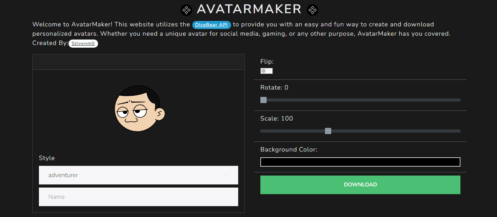

# AvatarMaker

Welcome to **AvatarMaker**!  
This web app uses the **DiceBear API** to let you create, customize, and download personalized avatars quickly and easily.

## 🛠️ Tech Stack

- **HTML, Bootstrap, Alpine.js**
- **DiceBear API**

## 🚀 Features

- 🎨 Create fully customizable avatars
- 💾 Download avatars in different formats
- 🔄 Multiple styles and customization options
- ⚡ Fast and responsive interface

